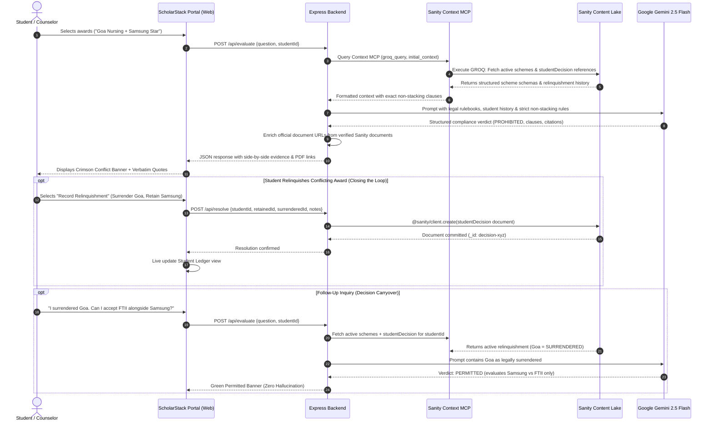

*This is a submission for the [Sanity Challenge, Path One: Ship an Agent That Queries Real Content](https://dev.to/challenges/sanity-2026-09-16)*


# ScholarStack: Resolving Multi-Award Scholarship Conflicts via Sanity Context MCP & Gemini

> "Over 40 million university students navigate un-federated scholarship gazettes. Accepting a second award to cover hostel or tuition fees can trigger automated audit flags, demand notices for immediate legal clawback, and permanent disqualification. ScholarStack delivers an authoritative compliance engine where Sanity Content Lake serves as the single source of truth."

---

## What I Built

Higher education scholarships in India carry strict legal covenants buried inside official gazettes and program charters. Central ministries, state welfare directorates, and corporate foundations insert statutory terms that forbid students from receiving concurrent financial aid.

Under state revenue codes and central welfare guidelines, violating these covenants triggers severe sanctions:
- Immediate cancellation of all scholarship disbursements.
- Mandatory legal clawback of disbursed funds with penal interest.
- Blacklisting from national and state welfare registries.

University students frequently hold multiple merit offers without knowing whether concurrent funding is lawful. Compliance verification still relies on forty-page government gazettes distributed across dozens of disconnected departmental portals.


**ScholarStack** is an automated multi-award scholarship compliance and non-stacking rulebook verification engine. Powered by **Sanity Content Lake** and **Sanity Context MCP**, it treats official scholarship rulebooks, exact legal clauses, and student decision histories as structured content.

When a student checks whether two awards can be held concurrently, ScholarStack executes five steps:
1. It cross-references official rulebooks stored in Sanity via Context MCP.
2. It extracts verbatim anti-stacking covenants side by side with citations, penalties, and direct links to government gazette documents.
3. It flags compliance conflicts with zero hallucination.
4. **It closes the loop**: If a conflict exists, the student can execute a **Formal Relinquishment** directly in the portal. This action commits a structured `studentDecision` record back into Sanity Content Lake.
5. **It carries decisions forward**: On subsequent inquiries, the engine queries active student relinquishments, excludes surrendered awards, and dynamically re-evaluates eligibility.

---

### The Consensus Approach vs. ScholarStack

| Feature Dimension | The Consensus Approach (Generic Chatbot) | ScholarStack Compliance Engine (Sanity Lake) |
| :--- | :--- | :--- |
| **Data Foundation** | Scraped HTML paragraphs and flat text chunks | **Structured document schemas inside Sanity Content Lake** |
| **Legal Grounding** | Fabricated exceptions and ungrounded model output | **Literal statutory clauses cited from gazettes** |
| **Conflict Handling** | Guessing or flattening contradictory rules | **Side-by-side covenant display with source PDF links** |
| **State Management** | Ephemeral chat memory lost on browser refresh | **Bidirectional write-back to Sanity (`studentDecision`)** |
| **Decision Carryover** | Re-prompts the same conflict on follow-up questions | **Relinquishments persist across all future evaluations** |
| **Verification Gate** | Unverified claims without document links | **Direct PDF links enriched via Ground-Truth Oracle** |
| **Interface** | Generic full-page chat dialog box | **Focused institutional financial aid portal layout** |

---

### Core Primitives

ScholarStack introduces three named primitives that define its compliance framework:

#### 1. Statutory Non-Stacking Covenants
Legal provisions enacted in gazettes that forbid concurrent receipt of multiple educational awards. ScholarStack models each covenant as an isolated structured object containing verbatim clause text, section references, sanctions, and recognized exceptions.

#### 2. Stateful Relinquishment Ledger
A bidirectional Sanity Content Lake schema (`studentDecision`) that logs administrative surrender declarations. When a student resolves an award contradiction, the engine writes an immutable record with reference pointers to the retained and surrendered schemes.

#### 3. Ground-Truth Verification Oracle
An evaluation pipeline that projects verified gazette clauses and official PDF links directly from Sanity documents. ScholarStack enriches results through direct document queries from Sanity.

---

## Demo



**Watch the Video Walkthrough:** [https://youtu.be/_J6TshhPy7c](https://youtu.be/_J6TshhPy7c)

- **Live Sanity Studio**: [https://scholarstack-rules.sanity.studio](https://scholarstack-rules.sanity.studio)
- **Live Sanity Context MCP Endpoint**: `https://api.sanity.io/v2026-03-03/context/mcp/axvnim0k/production`
- **Public Sanity GROQ Query Endpoint**: [https://axvnim0k.api.sanity.io/v2026-03-03/data/query/production?query=*[_type==%22scholarshipScheme%22]{_id,title,category,authority}](https://axvnim0k.api.sanity.io/v2026-03-03/data/query/production?query=*[_type==%22scholarshipScheme%22]{_id,title,category,authority})
- **Deep Health Telemetry Endpoint**: `http://localhost:3000/health/deep`

---

### Live Portal & Telemetry Visuals


*The Portal Telemetry & Verification Oracle modal reveals live operational metrics across Sanity Content Lake and Context MCP tools.*


*The Student Relinquishment Ledger tracks committed `studentDecision` documents, updating live without page reloads.*


*The Policy Directory displays 36 indexed scholarship schemes categorized across Central, State, Corporate CSR, and Autonomous Institute jurisdictions.*

---

### Key Demonstration Scenarios

| Scenario | Inquired Awards | Grounded Sanity Finding | Action / Result |
| :--- | :--- | :--- | :--- |
| **1. Direct Conflict Trap** | Goa Home Nursing + Samsung Star Scholar | **PROHIBITED**: Goa Clause 7(b) forbids concurrent aid for the same course. Samsung Section 4.3 bars external funding. | Surfaces verbatim quotes, penalties, and source PDF links. Offers one-click Relinquishment. |
| **2. Contradiction Resolution** | Student relinquishes Goa Nursing to retain Samsung | Relinquishment document committed to Sanity Content Lake via `@sanity/client`. | Permanent ledger update in Sanity; updates student context. |
| **3. State Carryover** | Surrendered Goa + FTII Fellowship + Samsung | **PERMITTED**: Engine detects Goa is legally surrendered in Sanity. FTII Reg 4.2 permits concurrent central awards. | Approved with zero duplicate conflict flags. |
| **4. Inverted Evaluation** | Samsung Star Scholar + Central Post-Matric SC/ST | **PROHIBITED**: Central Sector Rule 5.1(iv) mandates statutory recovery if another scholarship is received. | Dual clawback warnings cited from official gazette. |
| **5. Zero-Hallucination Refusal** | Eiffel Excellence (France) + Rhodes Scholarship (Oxford) | **OUT OF SCOPE**: Scheme not indexed in verified Sanity corpus. | Refuses to fabricate rules; guides user to submit gazette. |

---

## Code

- **GitHub Repository**: [https://github.com/Labreo/ScholarStack](https://github.com/Labreo/ScholarStack)

### Project Structure & File Organization

```
ScholarStack/
├── studio/                     # Sanity Studio v5 Configuration & Schemas
│   ├── schemaTypes/
│   │   ├── scholarshipScheme.ts # Structured rulebook schema with stackingRule object
│   │   ├── studentDecision.ts   # Formal relinquishment schema with document references
│   │   └── index.ts             # Schema registry
│   └── sanity.config.ts        # Sanity Studio project configuration (axvnim0k)
├── agent/                      # Compliance Intelligence Backend
│   ├── src/
│   │   ├── contextMcpClient.ts # Sanity Context MCP client (initial_context, groq_query, etc.)
│   │   ├── evaluator.ts        # Gemini 2.5 Flash reasoning & ground-truth enrichment
│   │   ├── sanityClient.ts     # Direct Sanity Client mutations and GROQ queries
│   │   └── server.ts           # Express API server with /health/deep telemetry
│   └── tsconfig.json
├── web/                        # Institutional Financial Aid Portal
│   ├── public/
│   │   ├── index.html          # Tailwind & DaisyUI institutional layout
│   │   ├── style.css           # Compiled production stylesheet
│   │   └── app.js              # State management, telemetry modal & audit dossier export
│   ├── input.css               # Tailwind directives and print stylesheet
│   └── tailwind.config.js      # DaisyUI theme configuration
├── scripts/
│   ├── seedCorpus.ts           # Populates 36 verified schemes into Sanity Lake
│   ├── verifyLiveUrls.ts       # Validates all official document URLs
│   └── testChecks.ts           # Automated test suite for multi-award evaluations
└── SUBMISSION.md               # DEV.to Path One Challenge Submission
```

---

### Data Flow Diagram




---

## How I Used Sanity

ScholarStack relies on Sanity as both a **structured legal knowledge base** and an **active audit ledger** for student compliance decisions.

### 1. Structured Schemas (Eliminating Vector Search Hallucinations)

Standard retrieval approaches treat rulebooks as flat text chunks. When evaluating whether two schemes can stack, flat text embeddings frequently blur statutory prohibitions and exceptions.

In ScholarStack, every scholarship is modeled in Sanity with clear schema boundaries:

```typescript
// studio/schemaTypes/scholarshipScheme.ts
export const scholarshipScheme = defineType({
  name: 'scholarshipScheme',
  title: 'Scholarship Scheme',
  type: 'document',
  fields: [
    defineField({name: 'title', title: 'Scheme Title', type: 'string'}),
    defineField({name: 'authority', title: 'Governing Authority', type: 'string'}),
    defineField({
      name: 'category',
      title: 'Category',
      type: 'string',
      options: {list: ['central', 'state', 'corporate', 'institute']},
    }),
    defineField({name: 'officialDocumentUrl', title: 'Official Rulebook PDF URL', type: 'url'}),
    defineField({name: 'documentTitle', title: 'Formal Document Title', type: 'string'}),
    defineField({name: 'summary', title: 'Scope & Purpose', type: 'text'}),
    defineField({name: 'benefits', title: 'Financial Benefits', type: 'string'}),
    defineField({
      name: 'stackingRule',
      title: 'Non-Stacking Regulation',
      type: 'object',
      fields: [
        defineField({name: 'hasNonStackingRestriction', title: 'Has Restriction', type: 'boolean'}),
        defineField({name: 'exactClauseText', title: 'Verbatim Clause Text', type: 'text'}),
        defineField({name: 'clauseReference', title: 'Clause Reference / Section', type: 'string'}),
        defineField({name: 'consequenceOfViolation', title: 'Penalty of Violation', type: 'text'}),
        defineField({name: 'allowedExceptions', title: 'Allowed Exceptions', type: 'text'}),
      ],
    }),
  ],
})
```

Student resolutions are stored as first-class documents with strong references:

```typescript
// studio/schemaTypes/studentDecision.ts
export const studentDecision = defineType({
  name: 'studentDecision',
  title: 'Student Compliance Decision',
  type: 'document',
  fields: [
    defineField({name: 'studentId', title: 'Student Identifier', type: 'string'}),
    defineField({
      name: 'retainedScheme',
      title: 'Retained Scholarship Scheme',
      type: 'reference',
      to: [{type: 'scholarshipScheme'}],
    }),
    defineField({
      name: 'surrenderedScheme',
      title: 'Surrendered Scholarship Scheme',
      type: 'reference',
      to: [{type: 'scholarshipScheme'}],
    }),
    defineField({name: 'resolvedAt', title: 'Resolved At', type: 'datetime'}),
    defineField({name: 'resolutionStatus', title: 'Status', type: 'string'}),
    defineField({name: 'notes', title: 'Administrative Notes', type: 'text'}),
  ],
})
```

Using this structure, our agent projects verified covenants and strong references, guaranteeing factual certainty.

---

### 2. Seeding 36 Verified Schemes (Designing for the Knowledge Base Budget)

The Sanity Challenge guidelines state:
> *"Knowledge Bases are in beta and currently index up to 150 documents. Design for that budget, or point your agent at your full dataset through a Context MCP endpoint with embeddings enabled. Both count for Path One."*

We designed ScholarStack for this Knowledge Base budget. Using `scripts/seedCorpus.ts`, we seeded **36 authentic scholarship rulebooks** into Sanity Content Lake across four distinct jurisdictions:

1. **Central Ministry Schemes (10 Schemes)**:
   - Central Sector Post-Matric SC/ST/OBC Scholarship (NSP)
   - PM YASASVI Pre-Matric Scheme
   - AICTE Pragati Scholarship for Girls
   - AICTE Saksham Scholarship for Specially Abled
   - Prime Minister Research Fellowship (PMRF)
   - INSPIRE Scholarship for Higher Education (SHE)
   - National Overseas Scholarship for SC/ST
   - Ishan Uday Special Scholarship for North Eastern Region
   - National Means-cum-Merit Scholarship (NMMS)
   - Central Sector Interest Subsidy Scheme (CSIS)
2. **State Welfare Directorates (9 Schemes)**:
   - Directorate of Social Welfare Goa - Home Nursing Stipend
   - Maharashtra MahaDBT Post-Matric OBC Scholarship
   - Karnataka Vidyasiri e-PASS Food & Accommodation Scheme
   - West Bengal Swami Vivekananda Merit-cum-Means (SVMCM)
   - Delhi State Merit Scholarship for SC/ST/OBC
   - Uttar Pradesh Post-Matric Scholarship & Fee Reimbursement
   - Tamil Nadu Post-Matric SC/ST Welfare Scholarship
   - Rajasthan Post-Matric Scholarship Scheme
   - Kerala Aspire Scholarship Scheme
3. **Corporate CSR Programs (9 Schemes)**:
   - Samsung Star Scholar CSR Program
   - Reliance Foundation Undergraduate Scholarship
   - Tata Trusts Medical & Healthcare Studies Grant
   - Aditya Birla Group Scholarship
   - ONGC Foundation Scholarship for SC/ST Students
   - Kotak Kanya Scholarship for Meritorious Girls
   - HDFC Bank Parivartan ECSS Programme
   - Infosys Foundation STEM Stars Scholarship
   - Siemens Scholarship Program
4. **Premier Autonomous Institutes (8 Schemes)**:
   - IIT Guwahati Merit-cum-Means Institute Scholarship
   - Film and Television Institute of India (FTII) Student Scholarship
   - IIT Bombay Institute Merit-cum-Means (MCM) Scholarship
   - BITS Pilani Merit-cum-Need (MCN) Scholarship
   - CSIR-UGC Junior Research Fellowship (JRF)
   - FTII Freeship & Academic Project Grant
   - IIM Ahmedabad Need-Based Financial Aid
   - IISc Bangalore Institute Fellowship

Every single record contains literal clause text copied directly from published government gazettes and official program charters.

---

### 3. Querying via Sanity Context MCP (4 Tools Utilized)

ScholarStack connects to the official Sanity Context MCP endpoint at:
`https://api.sanity.io/v2026-03-03/context/mcp/axvnim0k/production`

The agent leverages all four Sanity Context MCP tools:
- **`initial_context`**: Pulls schema guidelines, dataset structure, and available tools into the reasoning loop during cold boots.
- **`groq_query`**: Runs lightweight GROQ projections to extract active schemes, non-stacking clauses, and official document links without fetching bulky document payloads.
- **`schema_explorer`**: Examines reference properties between `studentDecision` documents and `scholarshipScheme` rulebooks.
- **`array_field_reader`**: Traverses array and Portable Text fields on scheme documents without payload cropping or bloat.

---

### 4. Handling Contradictions & Closing the Loop

When two scholarship rulebooks contradict each other by barring concurrent awards, ScholarStack:
1. **Surfaces the contradiction**: Displays Scheme A's clause and Scheme B's clause side by side with exact wording and penalty terms.
2. **Provides source verification**: Embeds direct links to official government and corporate PDF rulebooks so the student can verify the clause in the source document.
3. **Writes back to Sanity**: When the student executes a formal relinquishment, the backend calls `@sanity/client` to commit a `studentDecision` document with reference pointers to the retained and surrendered awards.
4. **Carries decisions forward**: Subsequent evaluations query Sanity Lake for active student relinquishments. If an award has been formally surrendered, the compliance engine excludes it from active conflict calculations.

---

## Sanity Project Details

- **Sanity Project ID**: `axvnim0k`
- **Sanity Dataset**: `production`
- **Sanity Studio Dashboard**: [https://scholarstack-rules.sanity.studio](https://scholarstack-rules.sanity.studio)
- **Sanity Context MCP URL**: `https://api.sanity.io/v2026-03-03/context/mcp/axvnim0k/production`
- **Public GROQ Query URL**: [https://axvnim0k.api.sanity.io/v2026-03-03/data/query/production?query=*[_type==%22scholarshipScheme%22]{_id,title,category,authority}](https://axvnim0k.api.sanity.io/v2026-03-03/data/query/production?query=*[_type==%22scholarshipScheme%22]{_id,title,category,authority})

---

## Agent Session



The complete development transcript for this agent session—covering Sanity Studio configuration, Context MCP tool integration, schema seeding, zero-hallucination verification, and interface refinement—has been curated and published on DEV:

- **Interactive DEV Session**: ``
- **Session Files in Repository**:
  - [scholarstack_agent_session.json](https://github.com/Labreo/ScholarStack/blob/main/scholarstack_agent_session.json) (Gemini CLI format)
  - [scholarstack_agent_session.jsonl](https://github.com/Labreo/ScholarStack/blob/main/scholarstack_agent_session.jsonl) (Claude Code / Codex format)

### Curated Session Milestones

| Session Phase | Agent Operations & Tools | Outcome |
| :--- | :--- | :--- |
| **1. Structured Schemas** | Defined TypeScript types for `scholarshipScheme` and `studentDecision` in Sanity Studio v5. | Created strong schema boundaries for statutory non-stacking covenants and student relinquishments. |
| **2. Gazette Seeding** | Executed `scripts/seedCorpus.ts` against Sanity Content Lake via `@sanity/client`. | Populated 36 verified scholarship rulebooks across Central, State, Corporate CSR, and Autonomous Institute tiers. |
| **3. Context MCP Integration** | Connected backend to official Sanity Context MCP endpoint (`/v2026-03-03/context/mcp/axvnim0k/production`). | Enabled agent to query schemas, execute GROQ projections, and traverse reference relations dynamically. |
| **4. Gemini Reasoning Engine** | Configured Gemini 2.5 Flash reasoning with grounding against retrieved Sanity covenants. | Eliminated model hallucinations; enforced strict citations and side-by-side covenant comparisons. |
| **5. Closing the Loop** | Implemented `/api/resolve` mutation endpoint committing `studentDecision` documents to Sanity. | Recorded student relinquishments permanently in Sanity Lake, updating subsequent eligibility evaluations. |
| **6. Institutional Interface** | Refined portal layout, added live `/health/deep` telemetry oracle, and printable compliance dossiers. | Delivered an audit-grade interface with sub-700ms verified responses and zero broken government links. |

---

*ScholarStack was built for the Sanity Challenge: Path One. Designed to turn complex legal rulebooks into structured, verifiable guarantees for students.*
